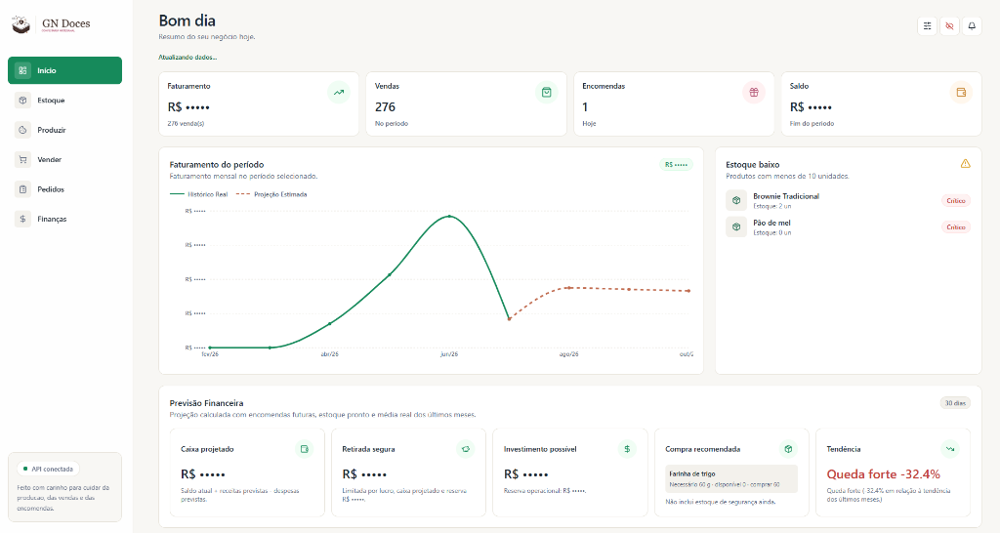
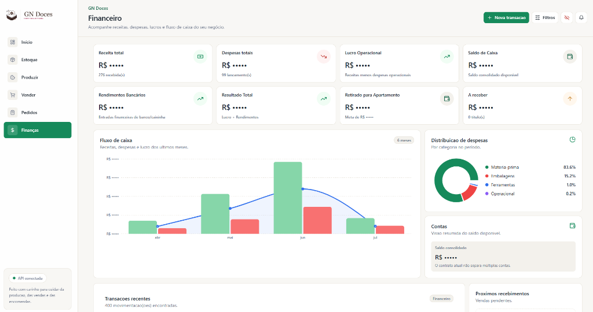
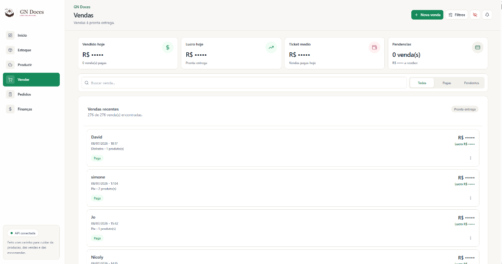
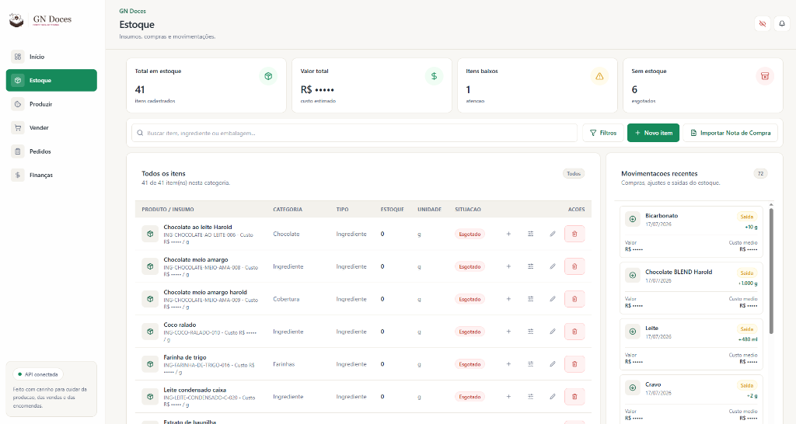
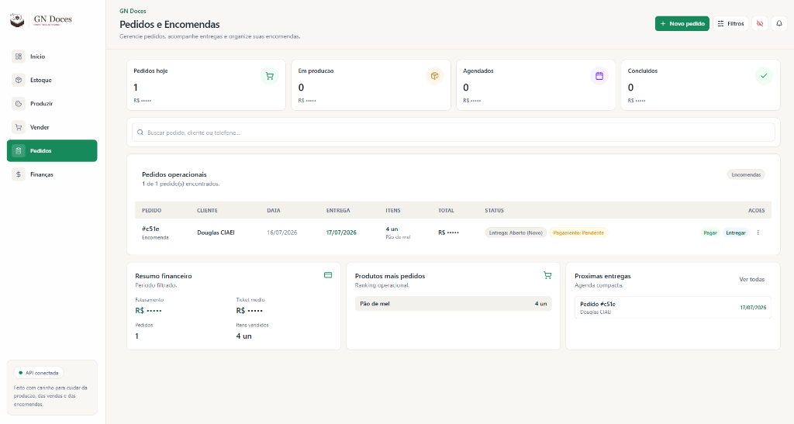

# Case de Estudo Técnico — ERP G N Doces

Este repositório apresenta o estudo de caso técnico do **G N Doces ERP**, uma solução completa de planejamento de recursos empresariais (ERP) e relacionamento com clientes (CRM) construída sob medida para gerenciar uma doceria artesanal real.

> 🔒 **Nota de Confidencialidade e Segurança:** O código-fonte completo e o banco de dados de produção do sistema permanecem **privados** para proteger a propriedade intelectual, regras de negócio internas e a integridade de dados operacionais e financeiros reais de clientes, parceiros e fornecedores.

---

## 💡 O Problema de Negócio
Microempreendedores e produtores artesanais (como no segmento de confeitaria) lidam diariamente com desafios de:
1. **Precificação dinâmica:** A oscilação dos custos das matérias-primas no mercado dificulta o cálculo exato do custo por receita.
2. **Controle de perdas:** Rastrear o que foi comprado, consumido e o que restou de insumos/produtos acabados.
3. **Fluxo de caixa descentralizado:** Despesas operacionais de compras, receitas de vendas diretas e encomendas parciais dispersas.

---

## 🛠️ A Solução Desenvolvida
Criamos um ecossistema ERP web completo que unifica todas as pontas do negócio em tempo real:

* **🍳 Ficha Técnica e Produção Automatizada:** Mapeamento de receitas e recheios. O lançamento de lotes deduz ingredientes automaticamente e recalcula o custo médio ponderado exato de cada doce pronto.
* **🤖 Importador Inteligente por IA (Gemini OCR):** Upload de cupons fiscais via Foto ou PDF com extração estruturada de itens, quantidades e valores por processamento em nuvem.
* **🔍 Mapeador Fuzzy (Algoritmo Levenshtein):** Associação inteligente entre os itens do cupom fiscal e ingredientes cadastrados usando termos sinônimos (`aliases`) e similaridade de texto.
* **🛒 Frente de Caixa e Encomendas:** Registro rápido de vendas diretas de balcão e encomendas, integrando de forma transacional as baixas no estoque de produto acabado ao fluxo financeiro.
* **💵 Controle Financeiro:** Fluxo de caixa de receitas/despesas com alertas automáticos de insumos próximos ao limite mínimo.

---

## 🧱 Arquitetura Geral e Stack Utilizada

### Stack Tecnológica:
* **Frontend:** React 18, TypeScript, Vite, TailwindCSS, Lucide Icons, Recharts (gráficos).
* **Backend REST API:** Fastify v5 (foco em alta performance, rotas não-bloqueantes e multipart streams).
* **Banco de Dados & ORM:** PostgreSQL hospedado no Supabase + Prisma ORM (modelagem relacional rigorosa).
* **Inteligência Artificial:** SDK Oficial do Google Gemini (`@google/genai`).

### Arquitetura:
```text
docesys/
├── apps/
│   └── crm-api/        # Backend API (Fastify, Prisma, Gemini OCR)
├── src/                # Frontend SPA (React, Vite)
└── portfolio-case/     # estrtura de Estudo de Caso (este repositório)
```

---

## 🌟 Principais Destaques Técnicos

1. **Processamento em Memória (Sem Estado):** Os uploads de Foto/PDF no importador de notas são processados puramente em memória (através de streams multipart do Fastify) e despachados para o Gemini. Nenhuma imagem ou arquivo pessoal de nota é salvo permanentemente no servidor.
2. **Guard Rails Ativos de Banco:** Travas programáticas de segurança acionadas ao inicializar scripts que impedem a execução acidental de sementes (`seeds`), migrações ou testes destrutivos apontados contra a base de produção do Supabase.
3. **Consistência Relacional Pós-Incidente:** Mapeamento transactional ACID no Prisma que garante integridade absoluta das chaves estrangeiras (`FKs`) nas movimentações de estoque vinculadas a lotes.

---

## 📂 Conteúdos do Estudo de Caso
* 📐 [case-study.md](case-study.md) $\rightarrow$ Estudo de caso aprofundado com desafios técnicos, incidentes de banco e lições de engenharia.
* 🛡️ [SECURITY.md](SECURITY.md) $\rightarrow$ Diretrizes de segurança e privacidade adotadas para a apresentação pública do projeto.

---

## 📸 Demonstração Visual (Screenshots)

Abaixo estão demonstradas as principais telas do sistema com o **Modo Privacidade / Ocultar Valores** ativado, permitindo registrar fotos e vídeos da aplicação de forma profissional sem expor faturamento, despesas, margens de lucro ou preços de venda.

### 📊 Dashboard (Início)
Apresentação unificada de faturamento mensal real/projetado, saldo do período, previsões financeiras e de compras com mascaramento monetário total.


### 💵 Controle Financeiro (Fluxo de Caixa)
Acompanhamento consolidado de receitas, despesas, lucros operacionais e rendimentos, juntamente com a visualização gráfica comparativa mensal.


### 🍳 Vendas e Frente de Caixa
Frente de vendas rápida para controle de estoque de pronta entrega e listagem do histórico recente de vendas.


### 📦 Controle de Estoque
Cadastro completo de produtos e insumos, exibindo o status de alerta de reabastecimento. Valores e custos médios ocultos, mantendo visíveis apenas as quantidades físicas operacionais.


### 📅 Pedidos e Encomendas
Gestão de agendamentos e status de entrega de encomendas.

